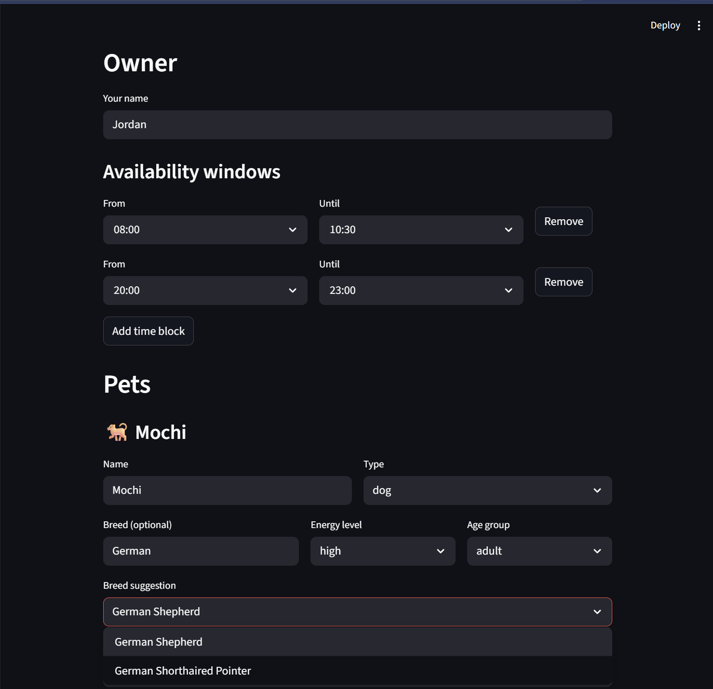
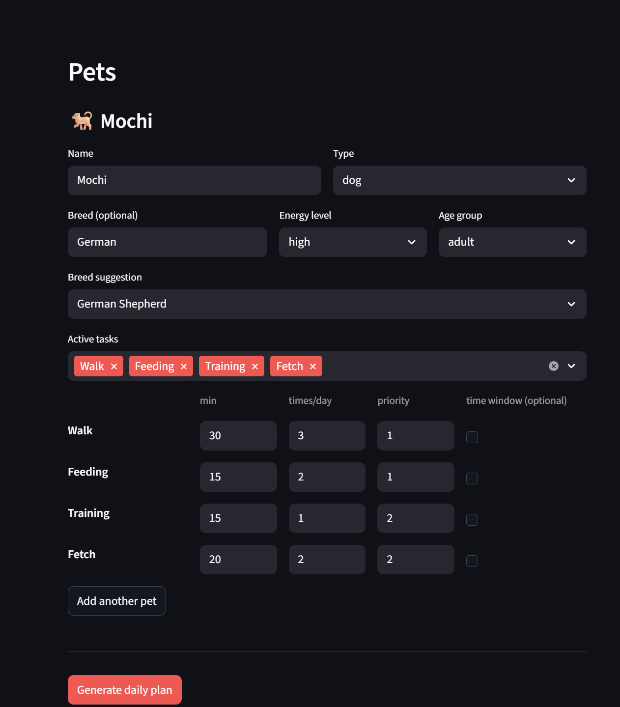
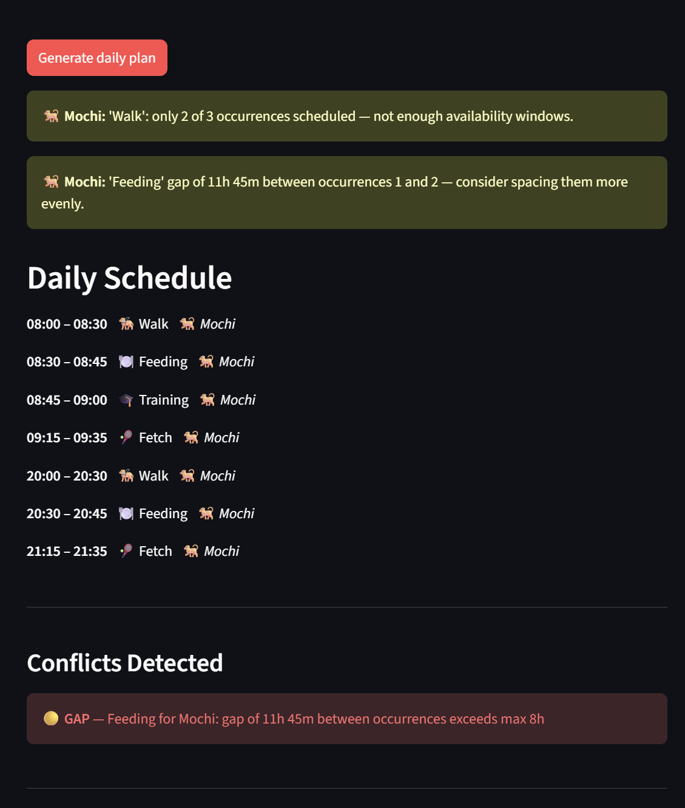
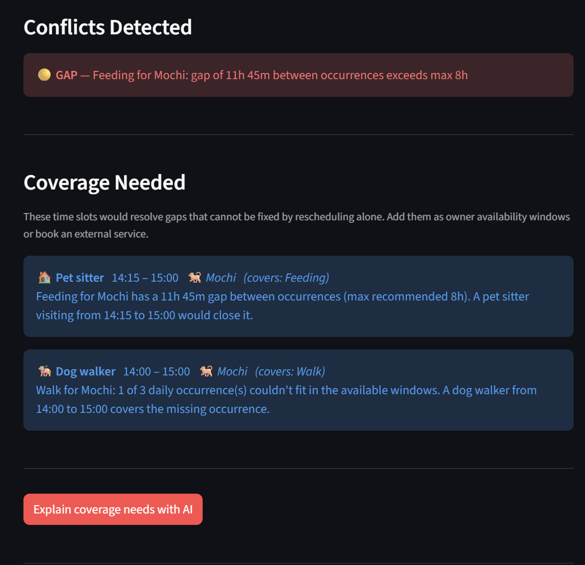
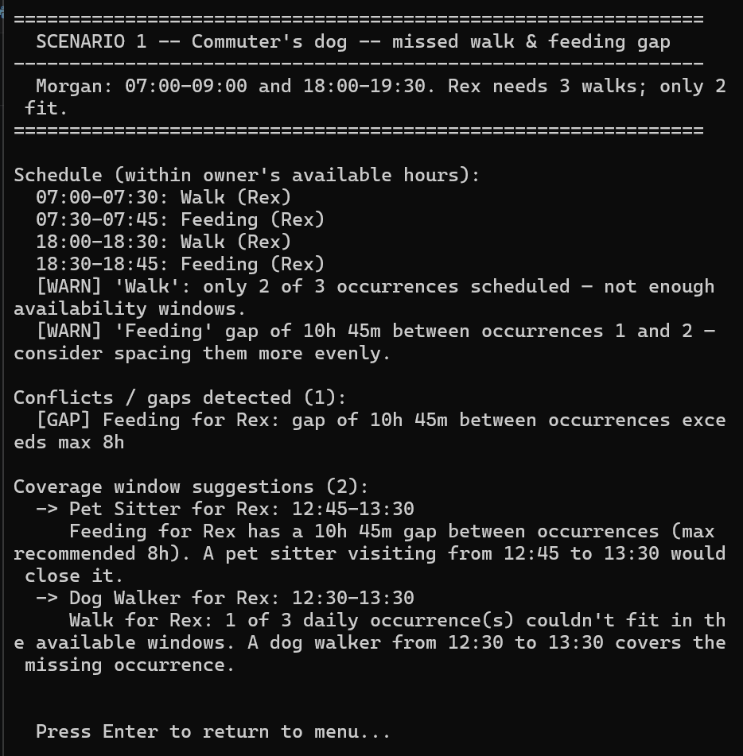
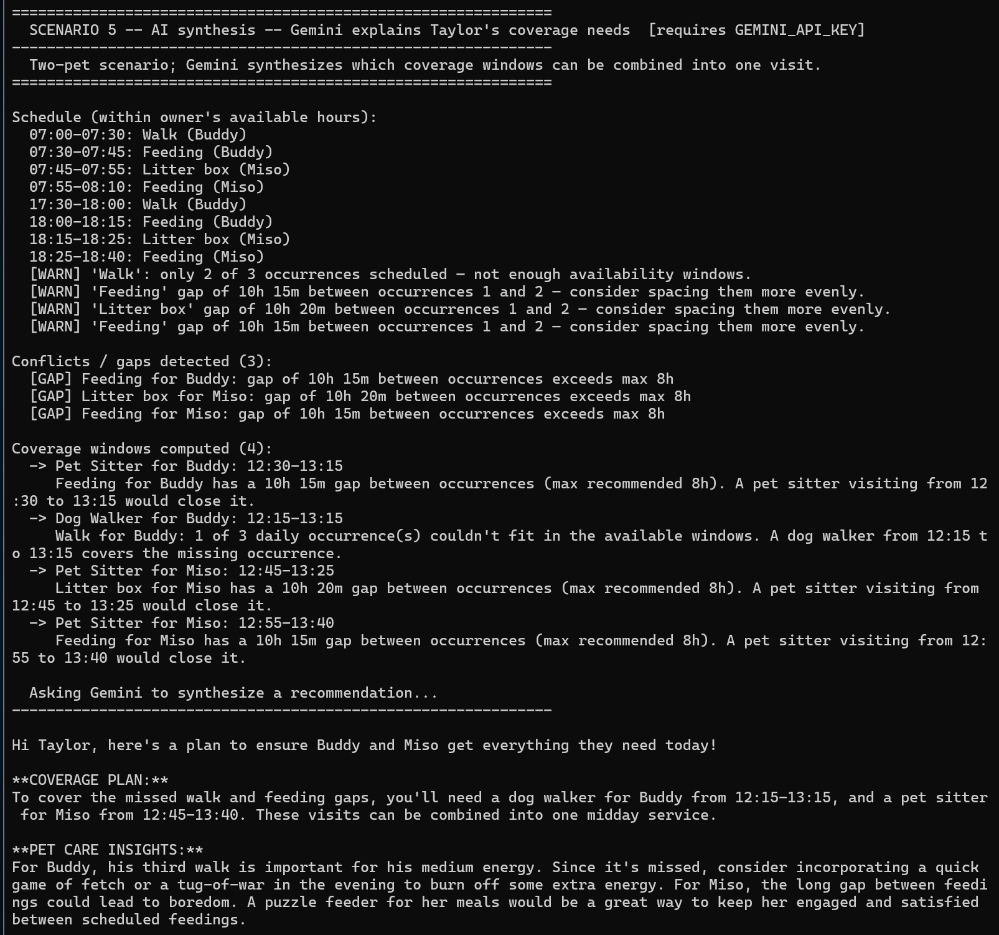
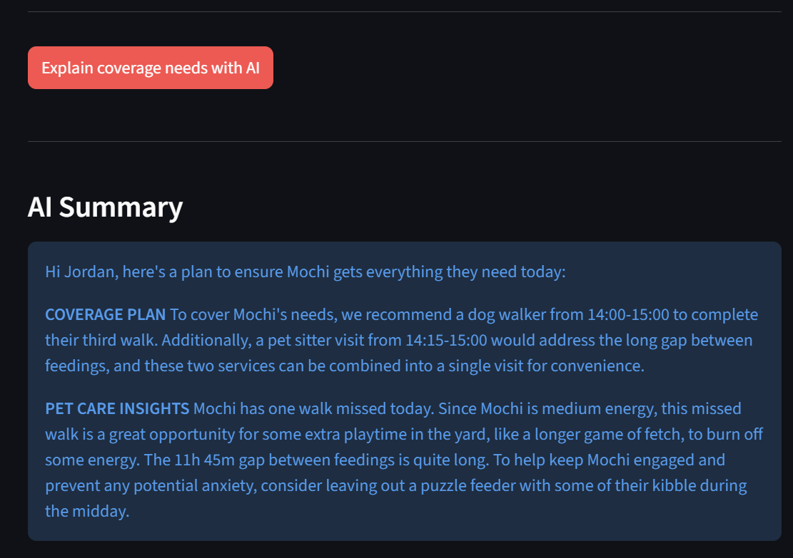

# 🐾 PawPal+ — AI-Powered Pet Care Scheduler

**Applied AI Final Project** | CodePath | Spring 2026

PawPal+ is an extension of [Pawpal](https://github.com/serena42/ai110-mod2-pawpal) helped pet owners plan their day.  Pawpal+ takes over when their schedule can't cover everything their pets need. A deterministic scheduler places care tasks within the owner's available hours; when tasks can't all fit or end up too far apart, the system computes specific coverage windows (🦮 dog walker / 🏠 pet sitter) and uses Gemini 2.5 Flash Lite to explain those windows in plain language — including care tips tailored to each pet's age group and energy level.







---

## 📋 Base Project

**PawPal** was a rule-based daily pet care planner built with Python and Streamlit. An owner describes their available hours and their pets' care tasks; the scheduler produces a time-blocked daily plan that respects task priority, dependency ordering (e.g., medication after feeding), and recurring-task spacing. It used no external AI — all scheduling decisions came from a deterministic greedy algorithm with composite urgency scoring.

---

## ✨ What PawPal+ Adds

**🤖 AI coverage synthesis** is the primary new feature. When the scheduler can't fit all occurrences of a task, or when tasks end up spaced beyond safe limits, the conflict detector computes the minimum external help needed — specific time slots for a dog walker or pet sitter. `ScheduleAgent.summarize_coverage()` then calls Gemini to turn those windows into a plain-language recommendation with pet-care insights specific to each pet's profile (e.g., using a puppy's missed walk as a leash-training session, or recommending a puzzle feeder for a high-energy dog facing a long gap between feedings).

Two additional features support this:

- 🔍 **Coverage window suggestions** — the rule-based conflict detector identifies seven conflict types (overlap, dependency, gap, dropped occurrence, and more) and computes specific, actionable time slots, routing walks to dog walkers and feeding/medication gaps to pet sitters.
- 🐕 **Breed-tuned task defaults** — a trie-based breed database applies age-group and energy-level multipliers to task duration and frequency, so a senior high-energy dog gets different defaults than a low-energy puppy.

---

## 🎥 Demo

> **Loom recording:** `https://www.loom.com/share/...`

**What the recording shows (2–3 minutes):**

1. Run `python demo_agent.py`, select **Scenario 1** (commuter's dog) — scheduler output, dropped walk warning, and coverage window suggestions printed to the terminal.
2. Select **Scenario 5** (AI synthesis) — same pipeline passing coverage windows to Gemini and printing the plain-language recommendation with pet-care tips.
3. Run `streamlit run app.py`, add an owner and pet, generate a schedule, and click **"Explain coverage needs with AI"** — show the AI summary panel.

<!-- 📸 SCREENSHOT: Terminal showing demo_agent.py Scenario 1 output — schedule, [WARN] lines, and coverage window suggestions. Save as assets/demo-terminal.png -->


<!-- 📸 SCREENSHOT: Terminal showing demo_agent.py Scenario 5 — the Gemini plain-language summary printed below the coverage windows. Save as assets/demo-ai-summary.png -->


---

## Portfolio Artifact

https://github.com/serena42/pawpal-applied-ai-final

This project demonstrates my ability to design hybrid AI systems that balance deterministic correctness with LLM‑driven interpretation. I built a fully testable scheduling engine with 128 automated tests, then layered AI on top only where it adds value: personalization, explanation, and behavioral insight. PawPal+ reflects my engineering philosophy — correctness in rules, clarity in architecture, and AI used intentionally rather than everywhere. It shows that I can design, implement, test, and document a complete system end‑to‑end.

---

## 🏗️ System Architecture


**Key files:**

| File | Role |
|---|---|
| `models.py` | Data model + Scheduler algorithm |
| `conflict_detector.py` | Conflict detection + coverage window suggestions |
| `agent.py` | Gemini-powered coverage synthesis (`summarize_coverage`) |
| `breed_db.py` | Trie-based breed lookup + age/energy multipliers |
| `app.py` | Streamlit UI |
| `main.py` | CLI demo (no API key needed) |
| `demo_agent.py` | 5-scenario scheduling pipeline demo; scenario 5 calls Gemini |
| `persistence.py` | JSON save / load |
| `test_scheduler.py` | 36 unit tests — Scheduler behavior |
| `test_agent.py` | 92 unit tests — conflict detector, breed trie, multipliers |
| `eval_coverage.py` | Evaluation script — 19 predefined checks across 6 scenarios, prints PASS/FAIL |

---

## ⚙️ Setup

**Requirements:** Python 3.11+, a Google Gemini API key (free tier works — only needed for AI features).

```bash
# 1. Clone and enter the repo
git clone <repo-url>
cd pawpal-applied-ai-final

# 2. Create a virtual environment
python -m venv .venv
source .venv/bin/activate        # Windows: .venv\Scripts\activate

# 3. Install dependencies
pip install -r requirements.txt

# 4. Set your Gemini API key (only needed for AI features)
export GEMINI_API_KEY="your-key-here"   # Windows: set GEMINI_API_KEY=your-key-here
```

**🖥️ CLI demo** (no API key required):
```bash
python main.py
```

**🌐 Streamlit UI** (no API key to generate schedules; key needed for AI summary button):
```bash
streamlit run app.py
```

**📋 Scheduling pipeline demo** (scenarios 1–4 need no API key; scenario 5 calls Gemini):
```bash
python demo_agent.py
```

**🧪 Run all tests:**
```bash
python -m pytest test_scheduler.py test_agent.py -v
python eval_coverage.py    # 19 predefined checks, prints PASS/FAIL
```

---

## 💬 Sample Interactions

### Example 1 — 🐕 Commuter's dog: scheduler drops 3rd walk, coverage computed

**Scenario:** Morgan is available 07:00–09:00 and 18:00–19:30. Rex (adult dog, high energy) needs 3 walks/day, but the adult 3-hour minimum gap between sessions means only 2 fit in the two windows. The two feedings end up 10 h 45 m apart, exceeding the 8-hour safe limit.

**Scheduler output:**
```
07:00-07:30: Walk (Rex)
07:30-07:45: Feeding (Rex)
18:00-18:30: Walk (Rex)
18:30-18:45: Feeding (Rex)
[WARN] 'Walk': only 2 of 3 occurrences scheduled - not enough availability windows.
[WARN] 'Feeding' gap of 10h 45m between occurrences 1 and 2
```

**Conflict detected:**
```
[GAP] Feeding for Rex: gap of 10h 45m between occurrences exceeds max 8h
```

**Coverage window suggestions:**
```
-> Pet Sitter for Rex: 12:45-13:30
   Feeding for Rex has a 10h 45m gap. A pet sitter visiting from 12:45 to 13:30 would close it.
-> Dog Walker for Rex: 13:05-13:55
   Walk for Rex: 1 of 3 daily occurrence(s) couldn't fit. A dog walker from 13:05 to 13:55 covers the missing occurrence.
```


---

### Example 2 — 🐕🐈 Two-pet household: Gemini synthesizes coverage advice with pet-care tips

**Scenario:** Taylor is available 07:00–09:00 and 17:30–19:00. Buddy (adult dog) needs 3 walks and 2 feedings; Miso (adult cat) needs 2 feedings and 2 litter-box cleanings. All tasks are scheduled but the 8.5-hour gap leaves every recurring task too far apart, and Buddy's 3rd walk is dropped entirely. *(Demo scenario 5 — requires `GEMINI_API_KEY`)*

**Coverage windows computed (rule-based):**
```
-> Dog Walker for Buddy: 13:00-13:50
   Walk for Buddy: 1 of 3 daily occurrence(s) couldn't fit. A dog walker from 13:00 to 13:50 covers the missing occurrence.
-> Pet Sitter for Buddy: 13:10-13:55
   Feeding for Buddy has a 10h 30m gap. A pet sitter visiting from 13:10 to 13:55 would close it.
-> Pet Sitter for Miso: 13:20-14:05
   Feeding for Miso has a 10h 30m gap. A pet sitter visiting from 13:20 to 14:05 would close it.
-> Pet Sitter for Miso: 13:30-14:15
   Litter box for Miso has a 10h 30m gap. A pet sitter visiting from 13:30 to 14:15 would close it.
```

**🤖 AI summary (Gemini):**
```
Taylor, all of Buddy and Miso's morning and evening care fits your current schedule,
but the gap between your windows leaves both pets unattended from 09:00 to 17:30.
Buddy is missing his third walk, and both pets' midday feedings — plus Miso's second
litter box cleaning — are overdue by the time you're home. The good news is that all
four coverage windows overlap: a single midday visit between 13:00 and 14:15 from
someone who can walk a dog and handle basic cat care would cover everything at once.

Pet care tips: Buddy's midday walk is a great opportunity for leash training — adult
dogs with high energy respond well to structured heel work during walks. For Miso,
leave an interactive puzzle toy out before you go; cats left alone for long stretches
are calmer and less likely to over-eat when they have enrichment available.
```

<!-- 📸 SCREENSHOT: Streamlit UI showing the AI summary panel after clicking "Explain coverage needs with AI" — the blue info box with Gemini's plain-language recommendation and pet-care tips. Save as assets/ui-ai-summary.png -->


---

## 🧠 Design Decisions

**⚡ Gemini 2.5 Flash Lite.** The AI task (coverage synthesis) is open-ended but short — a few sentences of plain-language advice. Flash Lite handles this cheaply and fast; a larger model adds latency with no observable quality gain.

**📐 Rule-based scheduling, AI for synthesis.** The scheduler is deterministic and directly testable — every output can be verified by re-running conflict detection. Letting the AI schedule would make the system unpredictable and untestable. AI is confined to one well-scoped role: narrating rule-based output in plain language with pet-specific insights.

**🔎 Trie for breed lookup.** Owners type a breed name. Trie prefix search is O(k) per lookup, requires no model, and handles partial matches ("Golden" → "Golden Retriever"). A vector store would add infrastructure cost and complexity with no benefit for this exact/prefix-match use case.

**🐾 Profile-tuned vs. generic AI output.** The coverage synthesis prompt passes each pet's species, age group, energy level, and task list to Gemini. The difference is measurable — compare the tip generated for Buddy (adult dog, high energy) in Example 2 with what a prompt stripped of all profile data produces:

| | AI output |
|---|---|
| **With profile context** | *"Buddy's midday walk is a great opportunity for leash training — adult dogs with high energy respond well to structured heel work during walks."* |
| **Without profile context** | *"Make sure your dog gets enough exercise and has access to fresh water throughout the day."* |

The profile-aware tip names the age group, energy level, and a specific training technique the helper can act on. Removing the pet profile from the prompt degrades the output to advice that fits any dog in any situation — which is no advice at all.

---

## 🧪 Testing

128 automated tests cover the scheduler, conflict detector, breed trie, and coverage engine. `eval_coverage.py` adds 19 PASS/FAIL integration checks across 6 realistic scenarios — including a control case where everything fits and no coverage is generated. Neither suite requires an API key. `summarize_coverage()` is exercised live via the Streamlit UI and programmed demo scenario.

```bash
python -m pytest test_scheduler.py test_agent.py -v   # 128 tests
python -m pytest test_scheduler.py -v                 # 36 — Scheduler behavior
python -m pytest test_agent.py -v                     # 92 — conflict detector, breed trie, multipliers
python eval_coverage.py                               # 19 predefined checks across 6 scenarios
```

---

## 📝 Reflection, Ethics, and AI Collaboration

[model_card.md](model_card.md) covers how AI was used during development, where it helped and where it fell short, the system's known limitations and bias risks, misuse potential, and ideas for future improvement.

---

## 🧭 Dear Future Me: Ideas for Enhancements

The philosophy that shaped v1: **keep correctness in deterministic rules; use AI where interpretation, personalization, or large-text knowledge adds value.** Every enhancement below is labeled by where the real work belongs.

### 🐶 Puppy Curriculum & Training Support

This is the most AI-appropriate expansion — puppy training knowledge is large, textual, and varies across sources. Rules can schedule the sessions; AI can explain and contextualize them.

- **Integrate structured socialization routines** (Puppy Culture, Avidog, AKC STAR Puppy). *AI value: these curricula differ in structure and terminology; an LLM can unify and summarize them for the owner.*
- **Use RAG to ground recommendations** against a curated corpus of training steps, exposure lists, and age-appropriate milestones. *Why RAG: prevents hallucinations, ensures consistency, and allows updates without code changes.*
- **Track exposures progressively** (sounds, surfaces, handling exercises). *AI value: the LLM can generate “why this matters today” explanations and suggest next steps.*
- **Add training-task categories** with frequency targets (short sessions, multiple times per day). *Hybrid: deterministic logic handles timing; AI provides behavioral insight and motivation.*

**Why this is AI-worthy:** the knowledge is too nuanced and text-heavy to hardcode. RAG + LLM gives grounded, curriculum-aligned guidance without compromising safety.

### 🤖 Agentic Task Integration

This is where agentic AI shines — not for correctness, but for workflow automation, reflection, and personalized summaries.

- **Push daily tasks into a reminder system automatically.** *Agentic value: the AI orchestrates reminders and tracks completions.*
- **Track completions, skips, and delays.** *AI value: the LLM detects patterns and generates insights.*
- **Generate weekly summaries** (“Here’s what went well; here’s what to adjust next week”). *AI value: natural-language synthesis of structured data.*
- **Detect routine drift** (e.g., consistently late walks) and suggest refinements. *AI value: pattern recognition + narrative explanation.*

**Why this is AI-worthy:** agentic workflows turn the schedule into a living routine. The rules produce the plan; the AI helps the owner live the plan.

### 👥 Multi-Caretaker Scheduling

This is almost entirely deterministic — a constraint-satisfaction problem — but AI can enhance the handoff experience.

- **Multiple humans with different capability profiles** (child can walk but not medicate; dog walker only walks/grooms). *Deterministic: capabilities → constraints → assignment.*
- **Caretaker availability windows and task assignment.** *Deterministic: classic scheduling logic.*
- **”Owner-only” flags for sensitive tasks.** *Deterministic: hard constraints.*
- **Fallback logic when windows are too narrow.** *Deterministic: reallocation rules.*
- **Optional AI layer:** explain why tasks were assigned to specific caretakers; generate handoff summaries (“Here’s what the dog walker needs to know today”).

**Why this stays mostly deterministic:** correctness matters more than creativity here. AI adds clarity, not logic.

### 📅 Expanded Scheduling Horizons

Rule-driven at its core, but AI can enrich the owner’s understanding of long-term patterns.

- **Weekly and monthly scheduling modes.** *Deterministic: recurrence rules.*
- **Less-than-daily routines** (reptile feeding every 2–3 days, weekly grooming, monthly nail trims). *Deterministic: interval logic.*
- **Recurring appointments** (groomer, vet, daycare). *Deterministic: calendar logic.*
- **Long-term medication cycles** (flea/tick/heartworm, vaccination boosters). *Deterministic: fixed intervals.*
- **Optional AI layer:** “month at a glance” summaries; seasonal context (“Shedding season means more grooming tasks this month”).

**Why this stays mostly deterministic:** these are predictable intervals. AI adds narrative, not scheduling logic.

